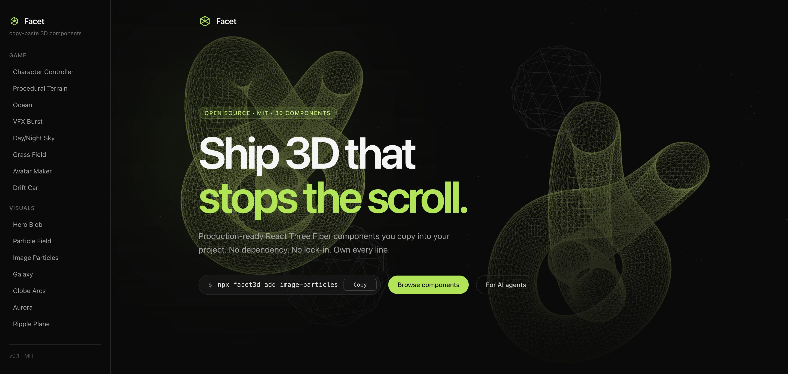
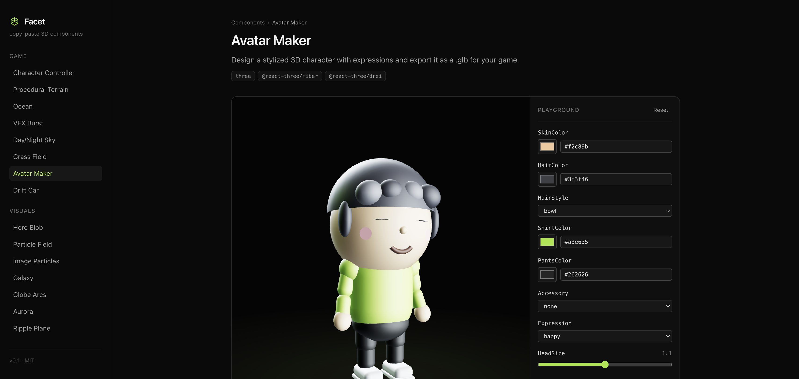
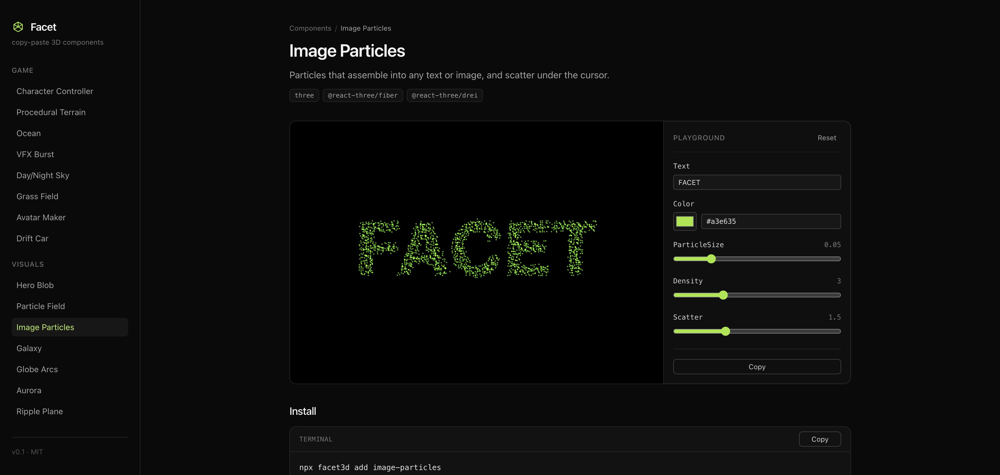
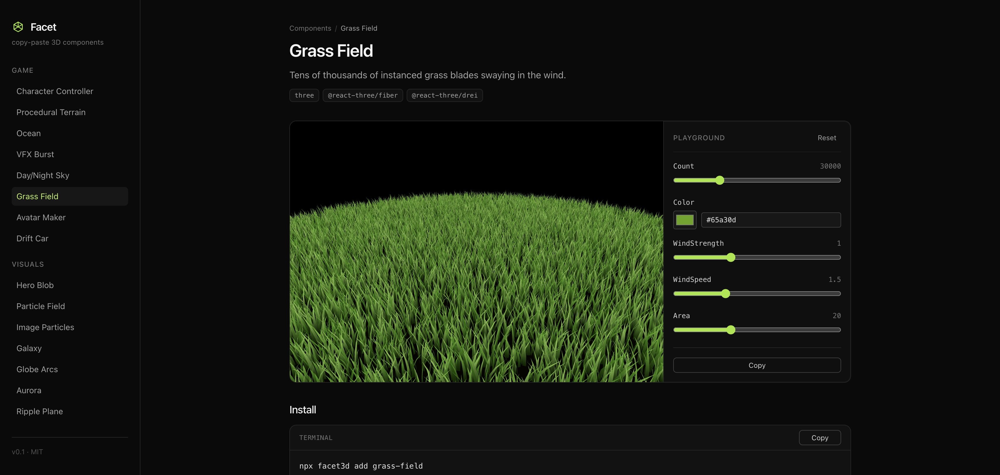
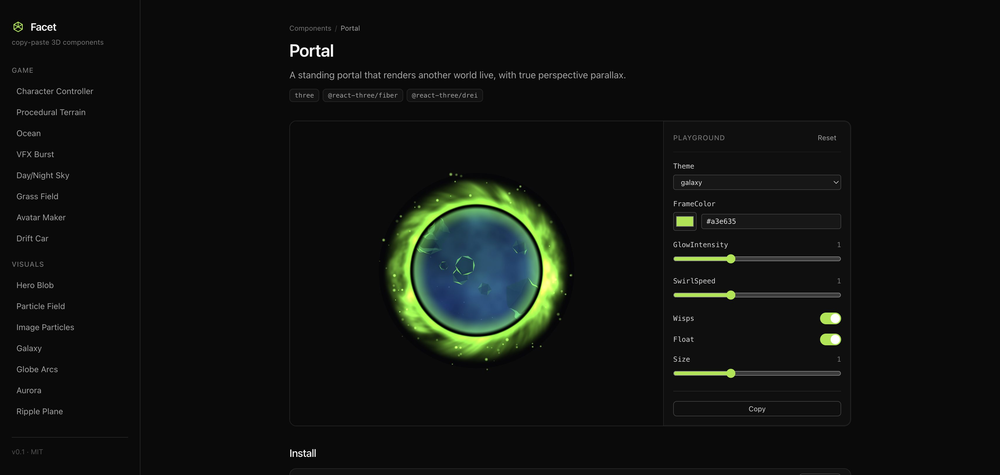
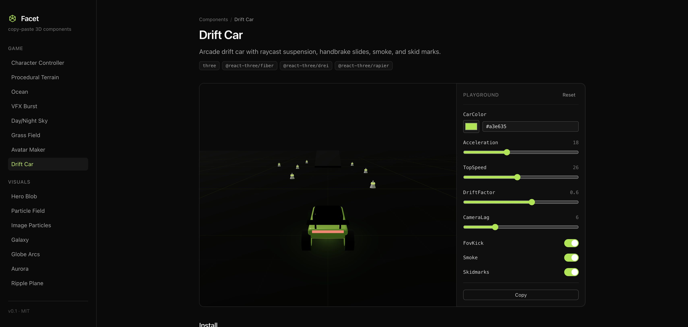
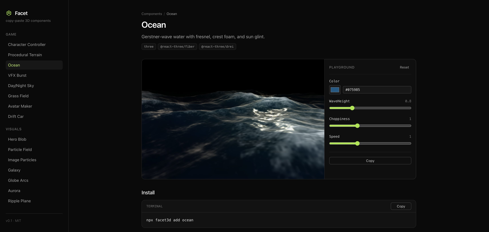

<div align="center">

# Facet

**Copy-paste 3D components for React.**

Production-ready React Three Fiber components you copy into your project. Not a dependency. No lock-in. Own every line.

[](https://www.npmjs.com/package/facet3d)
[](https://github.com/elberacasa/facet/tree/main/registry)
[](https://github.com/elberacasa/facet/blob/main/LICENSE)

```bash
npx facet3d add avatar-maker
```



</div>

## Why Facet

3D on the web is stuck: monolithic libraries, blurry demos, code you can't read. Facet is a registry of hand-crafted 3D components (game systems, shaders, generators) distributed as **source code**. One command drops a component into your repo, fully typed, ready to customize.

- **Copy-paste, not npm-install.** Components land in `components/facet/`. Tweak anything.
- **A playground for every prop.** Tune everything live in the docs, then copy the exact config.
- **Game tier included.** Character controller, procedural terrain, ocean, sky, grass, VFX, and an avatar maker that exports real .glb files.
- **Built for AI agents.** Machine-readable registry, `llms.txt`, and a CLI your agent can drive.

## Showcase

<table>
  <tr>
    <td><br><b>Avatar Maker</b> — design a character, export a .glb for your game</td>
    <td><br><b>Image Particles</b> — particles assemble into any text or image</td>
  </tr>
  <tr>
    <td><br><b>Grass Field</b> — 30,000 instanced blades swaying in the wind</td>
    <td><br><b>Portal</b> — a window into another world, live render target</td>
  </tr>
  <tr>
    <td><br><b>Drift Car</b> — arcade driving with raycast suspension and skid marks</td>
    <td><br><b>Ocean</b> — Gerstner waves, sky reflection, crest foam</td>
  </tr>
</table>

## Usage

```bash
# set up your project (installs three, @react-three/fiber, @react-three/drei)
npx facet3d init

# add a component
npx facet3d add image-particles

# browse the registry
npx facet3d list

# print docs for any component (agent-friendly)
npx facet3d docs image-particles --source
```

```tsx
'use client'

import { Canvas } from '@react-three/fiber'
import { ParticleField } from '@/components/facet/particle-field'

export default function Hero() {
  return (
    <div className="h-screen bg-black">
      <Canvas camera={{ position: [0, 0, 6] }}>
        <ParticleField />
      </Canvas>
    </div>
  )
}
```

## Components

**Game tier**

| Component | What it is |
| --- | --- |
| `avatar-maker` | Design a stylized 3D character with expressions and export it as a .glb |
| `character-controller` | Third-person controller: WASD, jumping, collision-aware camera (`@react-three/rapier`) |
| `procedural-terrain` | Seeded island worlds with biomes, trees, rocks, and water |
| `ocean` | Gerstner-wave water with sky reflection, subsurface tint, and foam |
| `day-night-sky` | Procedural sky dome with a full sun cycle, stars, and drifting clouds |
| `grass-field` | Tens of thousands of instanced grass blades swaying in the wind |
| `vfx-burst` | Multi-layer GPU particle effects: explosion, fire, smoke, magic |
| `drift-car` | Arcade drift car with raycast suspension, handbrake slides, and skid marks |

**Visuals**

| Component | What it is |
| --- | --- |
| `image-particles` | Particles that assemble into any text or image, and scatter under the cursor |
| `galaxy` | Procedural spiral galaxy with tens of thousands of shader-driven stars |
| `glass-prism` | Glass dispersion crystal with real refraction and chromatic aberration |
| `portal` | A standing portal that renders another world live, with true parallax |
| `god-rays` | Volumetric light shafts with drifting dust, zero post-processing |
| `silk-cloth` | Silk banner billowing in gusting wind, with pointer push and drag |
| `lightning-arcs` | Branching electric arcs with a white-hot core and pointer chasing |
| `face-puppet` | Webcam face-tracked head that mirrors your expressions |
| `globe-arcs` | Interactive dotted globe with animated connection arcs |
| `aurora` | Animated aurora gradient shader background |
| `ripple-plane` | Touch-responsive water surface |
| `node-network` | 3D plexus network of drifting, connected nodes |
| `cursor-trail` | A fluid ribbon of light that follows the cursor |
| `audio-visualizer` | Audio-reactive frequency rings: microphone or simulation |
| `hero-blob` | Morphing distortion sphere |
| `particle-field` | Interactive particle cloud that reacts to the cursor |
| `floating-shapes` | Drifting geometric primitives for ambient backgrounds |
| `wave-grid` | Shader-driven undulating wireframe terrain |
| `text-3d` | Extruded 3D typography with environment-lit materials |
| `model-viewer` | Drop-in GLTF model viewer with staging and orbit controls |
| `holo-card` | Holographic fresnel card with an iridescent sheen |
| `scroll-camera` | Scroll-driven camera flythrough scene |

## Made for AI agents

Facet is designed to be consumed by coding agents (Claude Code, Cursor, Copilot):

- `/llms.txt` and `/llms-full.txt` routes on the docs site describe every component, prop, and default
- `facet3d docs <name> --source` prints agent-consumable documentation and full source for any component
- The registry itself is machine-readable: [`registry/index.json`](registry/index.json)

## Repo layout

- `registry/`: the component source of truth (`index.json` + `components/*.tsx`)
- `apps/www`: the docs / playground site (Next.js)
- `packages/cli`: the `facet3d` CLI

## Develop

```bash
npm install
npm run dev    # docs site at localhost:3000
npm test       # CLI tests
```

## License

MIT
